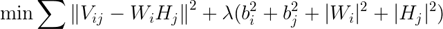
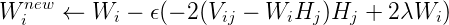
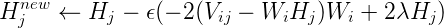
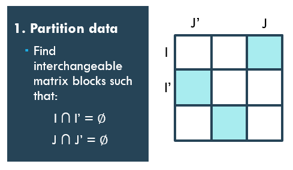

# Distributed Matrix Factorization Recommender

## Motivation

This project was motivated by my wanting to create an open source project recommender for GitHub. The data includes approximately 50.1M 'ratings' created from implicit feedback for 3.5M projects by 4.5M users. This matrix is both incredibly large and incredibly sparse. To give some context to the scale of the data:

 - Netflix's famous challenge consisted of 100M ratings of just 17k movies by 500k users.
  * Utility matrix is 0.05% size and ~3700 times as dense.

 - MovieLens' dataset is another well-known dataset for recommenders. The larger version consists of 10M ratings of 10.7k movies by 71.6k users.
  * Utility matrix is 0.004% size and ~4100 times as dense.

I wanted to include project side data to better explain user-item interactions. However, this isn't actually possible in MLlib and so I decided to create my own matrix factorization recommender Spark.

## Some math

If you already understand matrix factorization and various numerical methods used to obtain the factorized matrices then move right along!

### Matrix factorization

The Netflix Prize competition demonstrated the superiority of matrix factorization models over classic techniques such as nearest-neighbors. The main idea here is to try and reconstruct the utility matrix _V_ (n,m) by representing it as the product of two long matrices: _W_ (n,k) and _H_ (k,m).

This approach is closely linked to singular-value decomposition, which is a well-known technique for extracting latent features and reducing dimensionality. However, conventional SVD is done on a dense matrix and making the utility matrix dense can be both expensive and lead to an undesirable distortions of the data.

The most prevalent idea now is to model the observed ratings and avoid overfitting through regularization.

The cost function is the Frobenius norm of the reconstruction error. This implementation uses L2 regularization.

Both _Wi_ and _Hj_ are unknown so the cost function is not convex.

### Alternating Least Squares (ALS)

In ALS, we fix one of the unknowns and the problem then becomes quadratic. For instance, if we fix _W_ we can recompute _H_ by solving a least-squares problem and vice versa. Each _Wi_ (and _Hj_) is solved independently of the others and this allows the algorithm to be easily parallelized.

### Stochastic Gradient Descent (SGD)

Popularized by Simon Funk, a SGD approach loops through all the ratings in training set and computes the gradient. The parameters are then updated by an amount that is proportional to the gradient (as specified by learning rate).

## Implementation

Spark's implementation using alternating least squares. This is most likely due to the fact that it is easily parallelizable. Also, if implicit feedback data is given then the utility matrix typically cannot be considered sparse.

However, stochastic gradient descent is actually easier and faster than ALS and is also better suited for sparsity. The main issue becomes: __how can we perform SGD in a distributed fashion?__

## Distributed SGD

### 1. Partition data

In order to implement SGD in a distributed way, the crux of the solution lies in being able to find __interchangeable matrix blocks__ within _V_ such that for every two blocks, the row indices and column indices do not overlap. An example of this is shown below:

### 2. Perform SGD

Updates can now be done on each block by separate workers and these will not conflict with each other. This allows SGD to be performed in parallel.

### 3. Combine results and repeat

Updated _Wi_ and _Hj_ chunks from each worker are recombined and these steps are repeated until convergence or termination.

## Design choices and tuning

### Number of workers

Because of the way _V_ has to be segmented to find interchangeable matrix blocks, one iteration does not mean one epoch as would normally be the case with normal SGD. It would take approximately _numworkers_ number of iterations to reach one epoch. I still used a relatively large number of workers (~300 for my dataset) because it still reduced runtime.

### Half precision float

The default data type for numpy arrays is float64. I used float16 which uses a quarter as many bits. Not only does this reduce memory costs it also cuts down on the communication time required for the driver to send each chunk of _Vij_, _Wi_, and _Hj_.

While there is a necessary loss of precision, I didn't find it to be significant so long as rating values were not very small to begin with.

### Learning rate

This parameter proved difficult to tune. Initially my results diverged rapidly - especially with a large number of latent features. I found that starting with 0.001 and adding a learning schedule worked well.

### Ratings

Initially I used a simple binary system for my implicit feedback 'ratings' (every user-item interaction got a rating of 1). However, because the results were diverging rapidly and I was using a half precision float with a large number of features I increased the number itself to 5.

Currently I haven't incorporated baseline average values into this implementation because it was unnecessary for me but it's something I would like to add in the future.

### Density

As mentioned at the very beginning, my matrix was extremely sparse. However, I did actually use implicit feedback data which is one of the arguments for using ALS and distributed SGD still worked better.

I think this algorithm would scale well even with dense matrices because the _W_ and _H_ are dense and have to be communicated to each worker - regardless of the size of _V_. Although I don't have a real useful denser dataset of this scale to work with currently I may just generate some fake 'ratings' to make _V_ denser and try some benchmarking with that.

## Results

I used Spark's ALS MF recommender as a benchmark. Convergence results cannot be retrieved from this but for the same number of epochs and k, distributed SGD outperformed the built-in with regards to both runtime and MSE for my dataset.

The addition of basic side data also improved MSE. This is also a useful feature that is available in Graphlab but not in MLlib.

Finally, Spark's ALS implementation only provides max-iterations as termination criteria whereas this MF can also be terminated on both absolute and relative tolerance for error.
